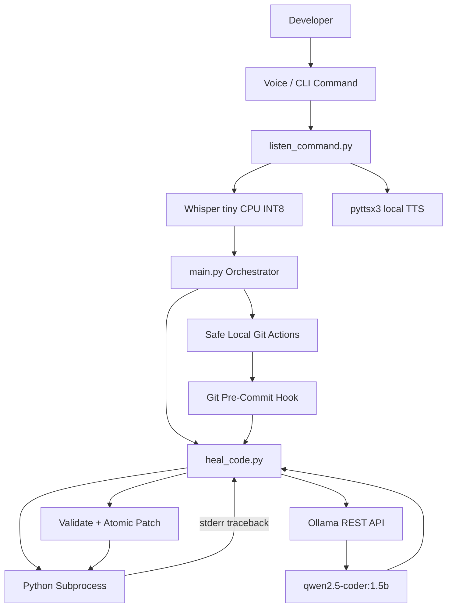

# voice-healer-agent

**Voice-Controlled Terminal Agent + Self-Healing Code Harness**
A local-first developer tool for Hacktoberfest / MLH-style open-source AI challenges.

## What it does

`voice-healer-agent` turns a spoken developer command into a local action and gives Python programs a self-healing execution loop.

The stack is designed to stay local after setup:

- **Speech-to-text:** `faster-whisper` with the CPU INT8 `tiny` model.
- **Text-to-speech:** `pyttsx3`.
- **Microphone capture:** `SpeechRecognition` + `PyAudio`.
- **Code repair:** Ollama REST API at `http://localhost:11434/api/generate`.
- **Coding model:** `qwen2.5-coder:1.5b`.
- **Execution:** Python subprocesses with bounded timeouts.
- **Safety:** failing source is backed up, model output is syntax-checked, statically scanned by a Safety Guard, patched atomically, and re-verified.
- **Developer workflow:** a local Git pre-commit hook can verify staged Python test files through the same harness.
- **Repair evidence:** the web Lab exposes a unified backup-to-current diff after each repair, making the generated change auditable before a demo or commit.
- **System Doctor:** a read-only local preflight checks Python, Ollama/model availability, Agent Skill files, optional voice dependencies, the Git hook, and the demo fixture.
- **Safety Guard:** AI-generated candidates are statically checked for newly introduced high-risk operations before approval or automatic application.

The project uses the portable [Agent Skills](https://agentskills.io/) directory format. `skills/voice-healer/SKILL.md` contains the standard YAML frontmatter and agent instructions.

> **Offline boundary:** installation and the first model downloads require network access. Once dependencies, the Whisper model, Ollama, and the Ollama coding model are present locally, the core runtime does not need a cloud API.

## Architecture



## Repository layout

```text
voice-healer-agent/
├── LICENSE
├── README.md
├── CONTRIBUTING.md
├── SECURITY.md
├── CODE_OF_CONDUCT.md
├── requirements.txt
├── sample_bug.py
├── fixtures/sample_bug.py
├── hooks/
│   ├── pre-commit
│   ├── install.ps1
│   └── install.sh
├── tests/
│   ├── test_audit.py
│   ├── test_approval.py
│   ├── test_doctor.py
│   ├── test_heal_code.py
│   ├── test_lifecycle.py
│   ├── test_main.py
│   ├── test_project_quality.py
│   ├── test_safety_guard.py
│   ├── test_safety_guard_http.py
│   ├── test_safety_guard_integration.py
│   └── test_ui_server.py
├── .github/
│   ├── workflows/ci.yml
│   └── ISSUE_TEMPLATE/
└── skills/
    └── voice-healer/
        ├── SKILL.md
        └── scripts/
            ├── audit.py
            ├── approval.py
            ├── doctor.py
            ├── heal_code.py
            ├── lifecycle.py
            ├── listen_command.py
            ├── main.py
            ├── safety_guard.py
            └── ui_server.py
└── ui/
    ├── index.html
    ├── app.js
    └── styles.css
```

### Important GitHub note

Git does not normally track `.git/hooks/`. The included tracked hook source and installers are what should be distributed. The extracted ZIP may also contain a local `.git/hooks/pre-commit` convenience copy, but a normal GitHub clone gets the tracked `hooks/pre-commit` file instead and should run an installer once. A fresh GitHub clone must recreate the hook locally or configure a tracked hook directory before relying on automatic pre-commit healing.

## Requirements

- Python 3.11 or newer.
- A working microphone for voice input.
- A local Ollama installation for code healing.
- Enough RAM/CPU for local Whisper and the selected Ollama model.
- PortAudio may be required by PyAudio on systems where a binary wheel is unavailable.

The current requirements file pins `faster-whisper` 1.2.1, compatible PyAV `av` 18.1.0, `pyttsx3` 2.99, `SpeechRecognition` 3.17.0, and `PyAudio` 0.2.14. `faster-whisper` supports Python 3.11+ and its CPU INT8 configuration is documented upstream. SpeechRecognition documents PyAudio as the microphone dependency. See the project pages for platform-specific installation details.

## Setup

### 1. Create a virtual environment

Linux/macOS:

```bash
python3 -m venv .venv
source .venv/bin/activate
python -m pip install --upgrade pip
python -m pip install -r requirements.txt
```

Windows PowerShell:

```powershell
py -3 -m venv .venv
.\.venv\Scripts\Activate.ps1
python -m pip install --upgrade pip
python -m pip install -r requirements.txt
```

If `PyAudio` needs a native PortAudio dependency on your platform, install PortAudio with your operating system package manager and rerun the Python dependency install.

### 2. Prepare Ollama

Start the local Ollama service, then pull the required coding model:

```bash
ollama serve
ollama pull qwen2.5-coder:1.5b
```

You can confirm the model is available with:

```bash
ollama list
```

The harness calls the Ollama REST endpoint directly with Python's standard-library `urllib`; no Ollama Python SDK is required.

### 3. Run the deliberate bug

```bash
python sample_bug.py
```

You should get a runtime `TypeError` because the sample concatenates a string with an integer.

### 4. Heal it

```bash
python skills/voice-healer/scripts/heal_code.py sample_bug.py
```

The harness will:

1. Execute the file.
2. Capture the traceback.
3. Create `sample_bug.py.bak`.
4. Ask local `qwen2.5-coder:1.5b` for a complete repair.
5. Strip Markdown fences if the model returns them.
6. Parse the candidate with Python's AST parser.
7. Write the patch atomically.
8. Execute the file again.
9. Restore the original source if all repair attempts fail.

After a successful demo, rerun:

```bash
python sample_bug.py
```


### Timing and trace behavior

The Lab header shows measured wall-clock duration for the current operation (`Run`, `Proposal`, `Apply`, `Reject`, or `Reset`). These values come from the local Python server using a monotonic timer around the operation; they are not generated or randomized. The Overview page contains an explicitly illustrative replay animation for presentation purposes and is not a live execution trace.

## Voice agent

Start the full voice loop:

```bash
python skills/voice-healer/scripts/main.py
```

For a deterministic terminal-only mode:

```bash
python skills/voice-healer/scripts/main.py --cli
```

To run one command without entering a loop:

```bash
python skills/voice-healer/scripts/main.py --command "heal sample_bug.py"
```

### Supported commands

```text
heal <python-file>
fix <python-file>
run <python-file>
doctor
git status
git diff
git log
git add <file> [file ...]
git commit <message>
help
quit
```

The voice parser intentionally does not expose arbitrary shell commands, Git push, reset, checkout, rebase, or remote administration.


## System Doctor

Run a read-only local preflight before a demo or repair session:

```bash
python skills/voice-healer/scripts/doctor.py
```

The doctor checks the Python version, core project files, Agent Skill metadata, Ollama reachability and the required `qwen2.5-coder:1.5b` model, optional voice packages, Git/hook setup, and the tracked broken demo fixture. It does not modify source code. The CLI agent also accepts `doctor`, `diagnose`, `check setup`, and `system check`. The browser exposes the same report under the **Doctor** view.


## Safety Guard

AI-generated repair candidates are inspected before an interactive approval can apply them. The guard compares the candidate with the current source and reports only risks newly introduced by the patch, reducing noise from legacy code while still blocking high-risk additions.

Blocked categories include shell/subprocess execution, network access, credential or secret-environment access, dynamic code execution, destructive file deletion, unsafe pickle deserialization, native-code loading, and writes to absolute or traversal paths. Ordinary new filesystem writes or permission changes are reported as review warnings rather than automatically blocked.

The approval UI shows the guard result beside the diff. A blocked proposal remains reviewable for inspection but its **Approve & apply** action is disabled. The backend repeats the safety scan during approval, so the guard cannot be bypassed by changing the pending payload or calling the approval endpoint directly.

The automatic healer also runs the same guard before it writes a model-generated candidate. A blocked candidate is discarded and the original backup is restored if no safe repair remains.

## Git pre-commit demo

The hook checks staged files that look like Python tests (`tests/*.py`, `test_*.py`, or `*_test.py`). If a test fails, the same self-healing harness is invoked before Git accepts the commit.

For a quick live demo:

```bash
cp sample_bug.py test_sample_bug.py
git add test_sample_bug.py
git commit -m "demo self healing"
```

The hook detects `test_sample_bug.py`, runs the local healer, re-stages the repaired file when needed, and blocks the commit if verification cannot succeed.

For a GitHub-distributed project, remember that Git excludes `.git/hooks/` from normal commits and clones. This challenge artifact includes the hook directly in its local `.git/hooks/` path; when distributing through GitHub, keep a tracked copy or installer outside `.git/hooks/` and install it into `.git/hooks/` after cloning.

## Live Hackathon demo script

### 90-second story

**1. Show the bug.**

```text
$ python sample_bug.py
TypeError: can only concatenate str (not "int") to str
```

**2. Ask the agent to heal it.**

Say:

```text
"heal sample_bug.py"
```

or run:

```bash
python skills/voice-healer/scripts/main.py --command "heal sample_bug.py"
```

**3. Point out the local AI boundary.**

The terminal shows `[Ollama]` and the model name `qwen2.5-coder:1.5b`. The repair request goes to localhost rather than a hosted coding service.

**4. Prove the repair.**

```bash
python sample_bug.py
```

The harness only reports success after executing the patched program successfully.

**5. Show the Git gate.**

Create a staged test file from the bug, commit it, and let the pre-commit hook invoke the same healing loop.

### Suggested narration

> "This is a developer agent that hears a local command, turns it into a deterministic action, and when Python fails it captures the actual traceback. Instead of sending source code to a cloud service, it sends the source and diagnostics to a local Ollama model. The patch is syntax-checked, written atomically, then executed again. The commit hook makes that same self-healing check part of the developer workflow."

## Automated checks

The repository ships a dependency-light test suite that runs without microphone hardware and without Ollama. CI checks supported Python versions, Python compilation, unit/integration tests, shell syntax, browser JavaScript syntax, and required project files. The UI Lab also renders a unified diff between the preserved `.bak` source and the current source after a repair.

Run locally:

```bash
python -m unittest discover -s tests -v
bash -n hooks/pre-commit hooks/install.sh
node --check ui/app.js
```

The healing tests use a localhost-compatible test HTTP server for the Ollama API contract, so CI never needs to download or run an LLM.

## Agent Skills compliance

The skill follows the current Agent Skills specification structure:

- `skills/voice-healer/SKILL.md` is the required skill manifest.
- `name` is lowercase and matches the skill directory name.
- `description` explains both capability and activation triggers.
- `compatibility` documents the local environment requirements.
- Executable implementation is bundled under `skills/voice-healer/scripts/`.

Validate the skill with the reference validator when it is installed:

```bash
skills-ref validate skills/voice-healer
```

## Design goals

### Local-first

No cloud speech recognition or cloud code-generation API is required for normal operation after setup.

### Auditable repairs

Every repair is grounded in the actual source and observed stderr. The original source is retained as a `.bak` backup before the first patch attempt.

### Fail closed

Invalid Python returned by the model is rejected. A successful repair must execute successfully. If all configured attempts fail, the original file is restored and a non-zero status blocks the Git commit.

### Hackathon-friendly

The project is intentionally small, readable, and demoable from a terminal. All core integration points are easy to inspect: microphone capture, local inference, subprocess execution, patch validation, and Git lifecycle integration.

## Lab lifecycle behavior

The interactive Lab uses a fresh lifecycle session each time the local UI server starts. Previous repair events remain available in History, but they do not pre-populate the current Lab with completed stages. `Reset Demo` starts a new cycle, clears any pending interactive proposal, and returns the Lab lifecycle to Idle.

Rejecting a proposal updates the lifecycle immediately. Terminal branches are explicit: a successful approval ends in `Verified`, a user rejection ends in `Rejected`, and an applied patch that fails verification ends in `Restored`; branches that were not taken are shown as skipped rather than pending.

## Troubleshooting

### "PyAudio is unavailable"

Use `--cli` to test the entire orchestrator without microphone hardware. For voice mode, install a compatible PyAudio build and make sure the operating system sees a usable microphone.

### "Whisper unavailable"

Install `faster-whisper` from `requirements.txt`. The first model load may download the model files; subsequent runs use the local cache.

### "Ollama is unreachable"

Start the local Ollama service and verify that `qwen2.5-coder:1.5b` appears in `ollama list`. The harness defaults to `http://localhost:11434/api/generate`, and you can set `OLLAMA_API_URL` when using a different loopback endpoint.

### The repair keeps failing

Open the `.bak` file to inspect the original source and the terminal traceback. The harness intentionally restores the original program after the configured repair attempts fail.

## License

MIT. See `LICENSE`.

## Local web UI

Voice Healer includes a dependency-free local web interface under `ui/`. The UI is a thin client over the same Python self-healing harness used by the CLI; it does not use a second or simulated AI backend.

Windows PowerShell:

```powershell
python skills/voice-healer/scripts/ui_server.py --open
```

Or double-click/run:

```text
run_ui.bat
```

Linux/macOS:

```bash
python skills/voice-healer/scripts/ui_server.py --open
```

The server binds only to a loopback host (`127.0.0.1`, `localhost`, or `::1`) and uses `127.0.0.1:8000` by default. Non-loopback bind addresses are rejected. It exposes only repository-bound operations: inspect Python files, run a target, heal a target through `heal_code.py`, and reset the demo file from its `.bak`. It does not execute arbitrary shell commands from browser input.

The UI contains Overview, Lab, Source, Skill, History, and Doctor views. The Lab's **Run**, **Heal**, and **Reset demo** buttons use the real local project files and local Ollama service. The History view shows a local repair audit trail with timestamps, targets, statuses, model, attempts, timing, return codes, and source hashes; the log intentionally does not store source code or prompts. The demo reset also works on a fresh clone because the original broken sample is kept in the tracked `fixtures/sample_bug.py` file; the reset creates the ignored `.bak` backup when needed. The voice hardware is intentionally optional in the UI; the project continues to support the offline Whisper path and CLI fallback when a microphone is available later.

### Git hook installation after a GitHub clone

Because `.git/hooks/` is not normally versioned by Git, the repository keeps a tracked hook source plus installers.

Linux/macOS:

```bash
bash hooks/install.sh
```

Windows PowerShell:

```powershell
.\hooks\install.ps1
```

Each installer copies `hooks/pre-commit` into the active repository's `.git/hooks/pre-commit`.

## Safe Patch Review

The browser Lab is approval-gated by design. The Lab also renders a repair lifecycle so a reviewer can see whether the run is analyzing, proposing, awaiting approval, applying, verifying, or in a terminal verified/restored/rejected state. Selecting **Propose repair** runs the current target and asks the local Ollama model for a candidate patch without writing it to the target. The UI shows the unified diff and waits for an explicit **Approve & apply** or **Reject** action. Approval is protected by a source SHA-256 check; if the target changes after proposal, the patch is rejected and a new proposal is required. Approved changes are backed up and verified, with automatic restoration if verification fails. CLI and pre-commit automation retain the non-interactive self-healing path for trusted local workflows.