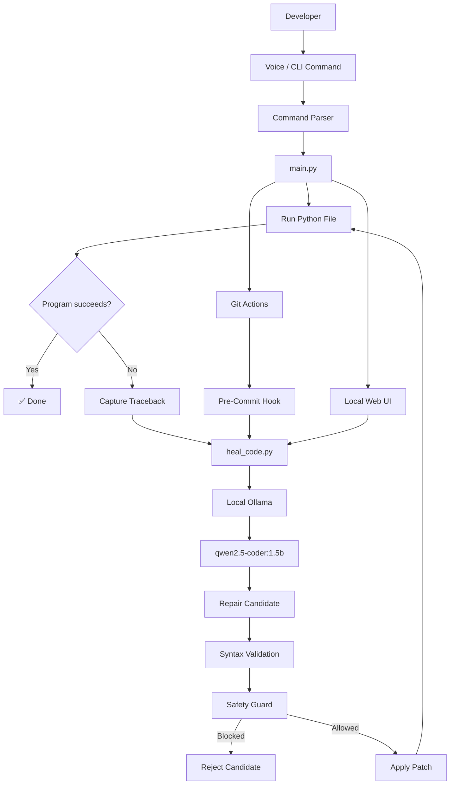

<h1 align="center">🎙️ Voice Healer</h1>

<p align="center">
  <strong>Offline Voice-Controlled Developer Agent + Self-Healing Code Harness</strong>
</p>

<p align="center">
  Turn developer commands into local actions, diagnose Python failures with a local AI model,
  review the proposed repair, and verify the result automatically.
</p>

<p align="center">
  <a href="https://github.com/Divasj007/voice-healer-agent/actions">
    
  </a>
  
  
  
  
  
</p>

---

## ✨ What is Voice Healer?

**Voice Healer** is a local-first developer tool that combines:

- 🎙️ Voice-controlled developer commands
- 🧠 Local AI-powered Python repair
- 🛡️ Static safety checks for generated patches
- 🔍 Human-readable repair diffs
- ✅ Automatic verification after every repair
- 🧾 Local repair history and audit information
- 🩺 A read-only System Doctor
- 🔗 Git pre-commit self-healing integration
- 🌐 A dependency-free local browser UI
- 📦 Portable [Agent Skills](https://agentskills.io/) packaging

The goal is simple:

> **When code breaks, Voice Healer should help diagnose it, propose a safe repair, and prove that the repaired program actually runs.**

After setup, the core AI and speech workflow runs locally. No cloud coding API is required for normal operation.

---

## 🚀 Why Voice Healer?

Traditional debugging usually looks like:

```text
Code
  ↓
Error
  ↓
Read traceback
  ↓
Search / reason about the problem
  ↓
Edit code
  ↓
Run again
  ↓
Repeat
```

Voice Healer turns that into a local automated loop:

```text
Developer command
      ↓
Voice / CLI parser
      ↓
Run Python program
      ↓
Capture traceback
      ↓
Local Ollama model
      ↓
Generate repair candidate
      ↓
Safety Guard
      ↓
Syntax validation
      ↓
Apply patch
      ↓
Run again
      ↓
✅ Verified
```

The important part is that a repair is not considered successful merely because an AI model generated code.

**The patched program must execute successfully.**

---

# 🎯 Core Features

| Feature | What it does |
|---|---|
| 🎙️ Voice Commands | Control supported developer actions using your microphone |
| 💻 CLI Mode | Run the same workflow without microphone hardware |
| 🧠 Local AI | Uses Ollama and `qwen2.5-coder:1.5b` locally |
| 🔧 Self-Healing | Uses real Python tracebacks to generate repair candidates |
| 🛡️ Safety Guard | Detects newly introduced high-risk operations |
| 👀 Safe Patch Review | Review a proposed repair before applying it |
| 🔍 Repair Diff | Compare original backup with the repaired source |
| 🧾 Repair History | Keep local audit information for previous repairs |
| 🩺 System Doctor | Check local setup without modifying source code |
| 🔗 Git Hook | Run self-healing verification during selected commits |
| 🌐 Web Lab | Inspect, run, propose, approve, reject, and reset repairs |
| 📦 Agent Skill | Ships as a portable Agent Skills package |
| ✅ Automated Tests | Dependency-light unit and integration test suite |
| 🔒 Local-first | Designed around local execution and localhost AI inference |

---

# 🎥 The Demo

Voice Healer includes a deliberately broken Python program so the complete workflow can be demonstrated quickly.

### 1. Run the broken program

```bash
python sample_bug.py
```

You should see a `TypeError`.

### 2. Ask Voice Healer to repair it

Using the CLI:

```bash
python skills/voice-healer/scripts/heal_code.py sample_bug.py
```

Or through the command agent:

```bash
python skills/voice-healer/scripts/main.py --command "heal sample_bug.py"
```

Or start the interactive voice agent:

```bash
python skills/voice-healer/scripts/main.py
```

Then say:

```text
heal sample_bug.py
```

### 3. Watch the repair process

The harness:

```text
1. Runs the Python program
2. Captures the traceback
3. Creates a .bak backup
4. Sends the failure context to local Ollama
5. Receives a repair candidate
6. Validates the candidate
7. Runs the Safety Guard
8. Applies the repair atomically
9. Runs the program again
10. Reports success only after verification
```

### 4. Verify the repaired program

```bash
python sample_bug.py
```

The program should now execute successfully.

---

# 🏗️ Architecture



---

# 🧩 Open-Source Stack

Voice Healer is built from open-source components and local developer tooling.

| Technology | Role |
|---|---|
| **Python** | Core runtime and orchestration |
| **Ollama** | Local model runtime |
| **Qwen2.5-Coder** | Local code-repair model |
| **faster-whisper** | Local speech-to-text |
| **SpeechRecognition** | Microphone input layer |
| **PyAudio** | Audio capture |
| **pyttsx3** | Local text-to-speech |
| **Agent Skills** | Portable skill packaging |
| **Git** | Developer workflow integration |
| **HTML / CSS / JavaScript** | Local browser interface |

---

# 🔐 Local-First & Privacy

Voice Healer is designed around local execution.

After setup:

- Speech recognition runs locally.
- Text-to-speech runs locally.
- Code repair uses a local Ollama endpoint.
- Python programs execute locally.
- Repair history is stored locally.
- The browser interface communicates with the local Python server.
- No cloud coding API is required for normal operation.

### Important offline boundary

Installing Python dependencies and downloading model files require network access.

Once the required dependencies and local models are installed, the core runtime can operate without a cloud AI service.

The default Ollama endpoint is:

```text
http://localhost:11434/api/generate
```

The project restricts AI inference to loopback/local endpoints.

---

# 🛡️ Safety Guard

AI-generated code should not automatically be trusted.

Voice Healer therefore checks repair candidates before applying them.

The Safety Guard looks for newly introduced high-risk operations such as:

- Shell or subprocess execution
- Network access
- Credential or secret-environment access
- Dynamic code execution
- Destructive file deletion
- Unsafe pickle deserialization
- Native-code loading
- Absolute-path or traversal writes

Ordinary filesystem writes and permission changes can be reported as review warnings rather than automatically blocked.

### Approval workflow

The browser Lab supports:

```text
Run
 ↓
Analyze
 ↓
Propose Repair
 ↓
Review Diff + Safety Result
 ↓
Approve & Apply
          OR
Reject
 ↓
Verify
```

A proposed repair is also protected by a source hash check. If the target file changes after the proposal is created, the proposal must be regenerated.

---

# 🔍 Auditable Repairs

Every repair starts from the actual program and its observed failure.

Before the first repair attempt, the original file is preserved as:

```text
sample_bug.py.bak
```

The workflow can then expose:

- Original source
- Proposed change
- Unified diff
- Repair status
- Model used
- Number of attempts
- Timing information
- Return code
- Source hashes
- Repair history

The audit trail does not intentionally store source code or model prompts.

---

# 🌐 Local Web UI

Voice Healer also includes a dependency-free local browser interface.

Start it with:

### Windows

```powershell
python skills/voice-healer/scripts/ui_server.py --open
```

Or:

```text
run_ui.bat
```

### Linux / macOS

```bash
python skills/voice-healer/scripts/ui_server.py --open
```

The UI provides:

```text
Overview
Lab
Source
Skill
History
Doctor
```

### Lab

The Lab is the main interactive repair workspace.

It can:

- Run the target
- Propose a repair
- Review the generated diff
- Show Safety Guard results
- Approve and apply a repair
- Reject a proposal
- Reset the demo

### History

History records local repair events including status, target, model, attempts, timing, return codes, and source hashes.

### Doctor

Doctor performs a read-only preflight of the local environment.

### Important

The browser UI is a local control interface over the same Python healing backend.

The microphone voice path remains available through the terminal voice agent.

---

# 🎙️ Voice Agent

Start the full voice loop:

```bash
python skills/voice-healer/scripts/main.py
```

For deterministic terminal-only operation:

```bash
python skills/voice-healer/scripts/main.py --cli
```

To execute one command directly:

```bash
python skills/voice-healer/scripts/main.py --command "heal sample_bug.py"
```

### Supported commands

```text
heal <python-file>
fix <python-file>
run <python-file>
doctor
git status
git diff
git log
git add <file> [file ...]
git commit <message>
help
quit
```

The command parser intentionally does **not** expose arbitrary shell execution or remote Git administration through voice commands.

---

# 🩺 System Doctor

Run:

```bash
python skills/voice-healer/scripts/doctor.py
```

Doctor performs a read-only local preflight covering things such as:

- Python environment
- Required project files
- Agent Skill metadata
- Ollama availability
- Required model availability
- Optional voice dependencies
- Git configuration
- Pre-commit hook setup
- Demo fixture

It does not modify your source code.

---

# 🔗 Git Pre-Commit Self-Healing

Voice Healer can integrate into Git through a pre-commit hook.

The tracked hook source lives here:

```text
hooks/pre-commit
```

Install it after cloning.

### Windows

```powershell
.\hooks\install.ps1
```

### Linux / macOS

```bash
bash hooks/install.sh
```

The installed hook checks staged Python test files.

If one of the selected staged tests fails, the same self-healing harness can attempt to diagnose and repair the failure before Git accepts the commit.

### Demo

```bash
cp sample_bug.py test_sample_bug.py
git add test_sample_bug.py
git commit -m "demo self healing"
```

The hook can detect the staged test file, run the repair workflow, re-stage a verified repair when appropriate, and block the commit when verification cannot succeed.

> Git does not normally version `.git/hooks/`, which is why this repository includes a tracked hook source and installation scripts.

---

# 🤖 What Happens During Healing?

A simplified repair looks like this:

```text
Python program
      ↓
Runtime failure
      ↓
Traceback captured
      ↓
Original source backed up
      ↓
Ollama receives local repair request
      ↓
Qwen2.5-Coder generates candidate
      ↓
Candidate syntax checked
      ↓
Safety Guard checks candidate
      ↓
Candidate written atomically
      ↓
Program executes again
      ↓
┌─────────────────────────┐
│ Verification successful │
│          ✅             │
└─────────────────────────┘
```

When all configured repair attempts fail:

```text
Candidate rejected
      ↓
Original source restored
      ↓
Non-zero result
      ↓
Commit / workflow blocked
```

---

# 📁 Project Structure

```text
voice-healer-agent/
├── .github/
│   ├── ISSUE_TEMPLATE/
│   │   ├── bug_report.md
│   │   └── feature_request.md
│   ├── pull_request_template.md
│   └── workflows/
│       └── ci.yml
│
├── fixtures/
│   └── sample_bug.py
│
├── hooks/
│   ├── pre-commit
│   ├── install.ps1
│   └── install.sh
│
├── skills/
│   └── voice-healer/
│       ├── SKILL.md
│       └── scripts/
│           ├── approval.py
│           ├── audit.py
│           ├── doctor.py
│           ├── heal_code.py
│           ├── lifecycle.py
│           ├── listen_command.py
│           ├── local_endpoint.py
│           ├── main.py
│           ├── safety_guard.py
│           └── ui_server.py
│
├── tests/
│   ├── __init__.py
│   ├── test_approval.py
│   ├── test_audit.py
│   ├── test_doctor.py
│   ├── test_heal_code.py
│   ├── test_lifecycle.py
│   ├── test_listen_command.py
│   ├── test_local_endpoint.py
│   ├── test_main.py
│   ├── test_project_quality.py
│   ├── test_safety_guard.py
│   ├── test_safety_guard_http.py
│   ├── test_safety_guard_integration.py
│   └── test_ui_server.py
│
├── ui/
│   ├── app.js
│   ├── index.html
│   └── styles.css
│
├── CONTRIBUTING.md
├── CODE_OF_CONDUCT.md
├── LICENSE
├── README.md
├── SECURITY.md
├── requirements.txt
├── run_ui.bat
├── run_ui.ps1
├── sample_bug.py
└── ...
```

---

# ⚙️ Requirements

- Python 3.11+
- A local Ollama installation
- The `qwen2.5-coder:1.5b` model
- A working microphone for voice mode
- Sufficient CPU/RAM for local Whisper and the selected coding model

The project pins its primary Python dependencies in:

```text
requirements.txt
```

The voice dependencies include:

```text
faster-whisper
SpeechRecognition
PyAudio
pyttsx3
```

---

# 👤 Using Your Own Python Project

Voice Healer does **not** require your Python file to be placed in a special folder.

Your target Python file can be anywhere **inside the cloned `voice-healer-agent` repository**.

For example:

```text
voice-healer-agent/
├── my_app.py
├── projects/
│   └── calculator.py
├── skills/
│   └── voice-healer/
│       └── scripts/
└── ...
```

You can then heal a file directly:

```bash
python skills/voice-healer/scripts/main.py --command "heal my_app.py"
```

Or a file in a subfolder:

```bash
python skills/voice-healer/scripts/main.py --command "heal projects/calculator.py"
```

You can also start the interactive voice agent:

```bash
python skills/voice-healer/scripts/main.py
```

Then say:

```text
heal projects/calculator.py
```

### Important path rule

When using the main Voice Healer orchestrator, the target must:

- Be a Python file (`.py`)
- Exist inside the cloned repository
- Not point outside the repository

This restriction is intentional and prevents the orchestrator from modifying arbitrary files elsewhere on the computer.

---

## ✅ First-Time Setup at a Glance

A new user only needs to do this once:

```text
1. Clone Voice Healer
        ↓
2. Create a Python virtual environment
        ↓
3. Install requirements.txt
        ↓
4. Install Ollama
        ↓
5. Pull qwen2.5-coder:1.5b
        ↓
6. Put your Python project/file inside the repository
        ↓
7. Run Voice Healer against the target file
```

For the first test, use the included `sample_bug.py`.

# 🚀 Installation

## 1. Clone the repository

```bash
git clone https://github.com/Divasj007/voice-healer-agent.git
cd voice-healer-agent
```

## 2. Create a virtual environment

### Windows PowerShell

```powershell
py -3 -m venv .venv
.\.venv\Scripts\Activate.ps1
python -m pip install --upgrade pip
python -m pip install -r requirements.txt
```

### Linux / macOS

```bash
python3 -m venv .venv
source .venv/bin/activate
python -m pip install --upgrade pip
python -m pip install -r requirements.txt
```

If PyAudio requires a native PortAudio installation on your platform, install the appropriate PortAudio package for your operating system and rerun the dependency installation.

---

# 🧠 Set Up Ollama

### 1. Install Ollama

Install the Ollama application separately from the project repository, then start the local service:

```bash
ollama serve
```

### 2. Download the local coding model

The AI model is **not bundled inside this GitHub repository**. Voice Healer uses Ollama to run the model locally.

Download the model once:

```bash
ollama pull qwen2.5-coder:1.5b
```

Check that it is available:

```bash
ollama list
```

You should see:

```text
qwen2.5-coder:1.5b
```

After Ollama and the model are installed, code-repair inference runs locally through Ollama. No cloud coding API is required for the normal healing workflow.

Voice Healer communicates with Ollama through its local REST API using Python's standard library.

No Ollama Python SDK is required.

---

# 🧪 Run the Test Suite

The project contains a dependency-light automated test suite.

Run:

```bash
python -m unittest discover -s tests -v
```

The **v1.0.0 release** was verified with:

```text
124 tests passing
```

The tests are designed so the core suite can run without:

- Microphone hardware
- A running LLM
- Cloud AI services

Additional local checks:

```bash
bash -n hooks/pre-commit hooks/install.sh
node --check ui/app.js
```

The healing tests use a local test HTTP server for the Ollama API contract, so CI does not need to download or run an LLM.

---

# 📦 Agent Skills

Voice Healer ships with a portable Agent Skills package:

```text
skills/voice-healer/SKILL.md
```

The skill contains standard metadata including:

- `name`
- `description`
- `compatibility`

Implementation scripts are bundled inside:

```text
skills/voice-healer/scripts/
```

When the reference validator is installed:

```bash
skills-ref validate skills/voice-healer
```

---

# ⏱️ Repair Lifecycle

The browser Lab represents the repair lifecycle explicitly.

A normal successful repair can move through:

```text
Idle
 ↓
Running
 ↓
Analyzing
 ↓
Proposed
 ↓
Awaiting Approval
 ↓
Applying
 ↓
Verifying
 ↓
Verified
```

Other terminal states include:

```text
Rejected
Restored
```

When an operation takes a branch that is not used, the Lab displays it as skipped rather than leaving it in a misleading pending state.

The current operation timing shown in the Lab is measured locally using a monotonic timer.

---

# 🧭 Design Principles

## Local-first

Normal operation does not require a cloud speech or cloud code-generation service.

## Fail closed

Invalid Python is rejected.

A successful repair must execute successfully.

If configured repair attempts fail, the original source is restored.

## Auditable

Repairs are based on actual source code and real runtime diagnostics.

The original source is preserved before repair attempts.

## Safe-by-default

Generated candidates pass static safety checks before automatic application or interactive approval.

## Hackathon-friendly

The project is intentionally designed to be:

- Easy to run
- Easy to inspect
- Easy to demonstrate
- Easy to test
- Easy to extend

---

# 🎬 90-Second Hackathon Demo

### Step 1 — Show the bug

```bash
python sample_bug.py
```

Show the runtime error.

### Step 2 — Start Voice Healer

```bash
python skills/voice-healer/scripts/main.py
```

Say:

```text
heal sample_bug.py
```

### Step 3 — Explain the local AI

Point out:

```text
[Ollama]
qwen2.5-coder:1.5b
```

The repair request is sent to the local Ollama service.

### Step 4 — Show verification

The harness should report successful verification only after the repaired program executes successfully.

### Step 5 — Show the browser Lab

Open the local web interface and demonstrate:

```text
Overview → Lab → Source → History → Doctor
```

### Step 6 — Show the Git gate

Demonstrate the pre-commit hook using a staged Python test file.

---

# 🛠️ Troubleshooting

## PyAudio is unavailable

For a hardware-independent test:

```bash
python skills/voice-healer/scripts/main.py --cli
```

For voice mode, install a compatible PyAudio build and make sure your operating system detects the microphone.

---

## Whisper is unavailable

Install dependencies from:

```text
requirements.txt
```

The first Whisper model load may download model files. Later runs can use the locally cached model.

---

## Ollama is unreachable

Start Ollama:

```bash
ollama serve
```

Then verify:

```bash
ollama list
```

Make sure:

```text
qwen2.5-coder:1.5b
```

is available.

---

## Repair keeps failing

Inspect the original backup:

```text
sample_bug.py.bak
```

and review the traceback shown by the harness.

When all configured repair attempts fail, the original program is intentionally restored.

---

# 🤝 Contributing

Contributions are welcome.

Please read:

```text
CONTRIBUTING.md
```

before opening an issue or pull request.

Useful contribution areas include:

- Better voice command recognition
- Additional programming-language support
- More repair validation strategies
- Additional Safety Guard rules
- UI improvements
- More test coverage
- Agent Skills integrations
- Developer workflow integrations

---

# 🔐 Security

Please read:

```text
SECURITY.md
```

before reporting a security issue.

The Safety Guard is a **defense-in-depth static analysis layer**, not a complete sandbox.

Do not treat generated code as inherently safe merely because it passes the guard.

---

# 📄 License

Voice Healer is released under the:

**MIT License**

See:

```text
LICENSE
```

---

# 🌟 Project Links

**Repository**

https://github.com/Divasj007/voice-healer-agent

**Agent Skills**

https://agentskills.io/

**Ollama**

https://ollama.com/

---

<p align="center">
  Built with Python, local AI, open-source tooling, and a lot of debugging.
</p>

<p align="center">
  🎙️ <strong>Speak.</strong> 🧠 <strong>Repair.</strong> 🛡️ <strong>Review.</strong> ✅ <strong>Verify.</strong>
</p>
